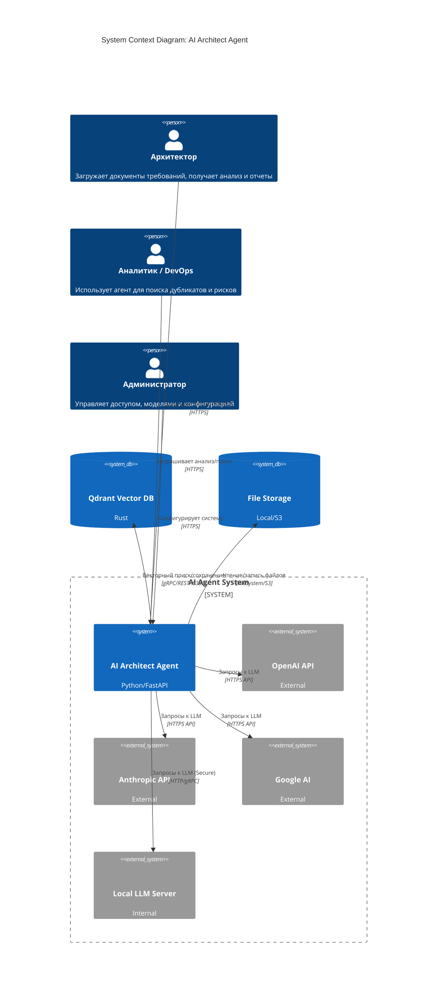
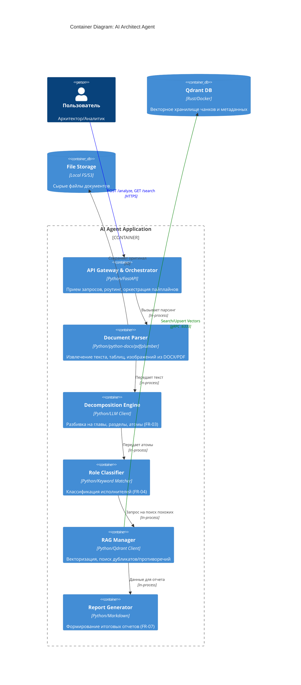
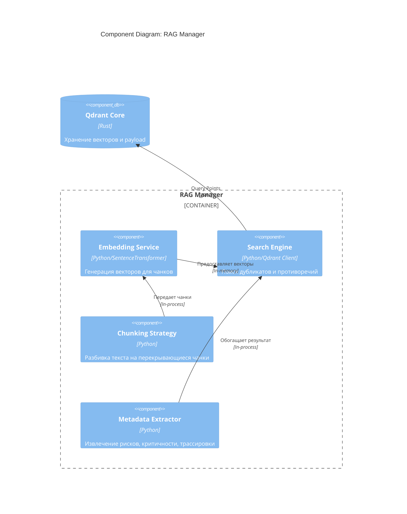
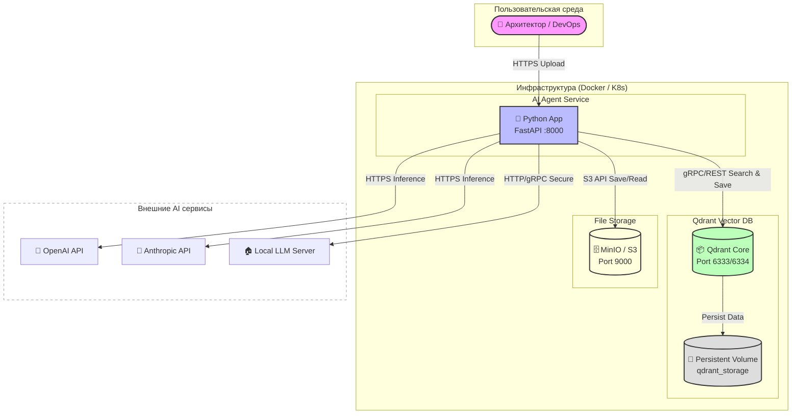

# Архитектура решения (Solution & Infrastructure)

## 1. Общее описание системы

Система **AI Architect Agent** представляет собой специализированный сервис для автоматизированного анализа неформализованных документов с требованиями, их декомпозиции на атомарные единицы знаний и интеграции с базой знаний (RAG) на основе векторной базы данных Qdrant.

### Ключевые принципы
- **Модульность**: Разделение ответственности между парсингом, декомпозицией, классификацией и RAG.
- **Безопасность**: Работа только во внутреннем контуре, поддержка локальных LLM.
- **Масштабируемость**: Stateless архитектура основного сервиса, отдельное состояние в Qdrant.
- **Гибкость**: Подключение к 4+ AI моделям через единый интерфейс.

---

## 2. Модель C4 (Context, Container, Component, Code)

### Уровень 1: Контекст (System Context)

**Описание контекста:**
- **Пользователи**: Архитекторы, Аналитики, DevOps, Администраторы (роли FR-01).
- **Система**: Единый сервис `AI Architect Agent`.
- **Внешние зависимости**: 
  - AI провайдеры (внешние или внутренние).
  - Qdrant (векторная БД).
  - Файловое хранилище.

---

### Уровень 2: Контейнеры (Container Diagram)

**Описание контейнеров:**
1.  **API Gateway & Orchestrator**: Точка входа, валидация токенов, проверка ролей.
2.  **Document Parser**: Модуль извлечения контента (текст, таблицы, картинки).
3.  **Decomposition Engine**: Логика разбивки на иерархию (Глава -> Раздел -> Абзац -> Атом).
4.  **Role Classifier**: Определение исполнителей по ключевым словам.
5.  **RAG Manager**: Работа с эмбеддингами и Qdrant.
6.  **Report Generator**: Сборка финального Markdown отчета.

---

### Уровень 3: Компоненты (Component Diagram - RAG Manager)

---

## 3. Инфраструктура (Infrastructure)

### Схема развертывания (Deployment View)

Инфраструктура развертывается в виде изолированных Docker-контейнеров внутри периметра компании.

**Описание компонентов инфраструктуры:**

| Компонент | Тип | Порт | Описание |
|-----------|-----|------|----------|
| **AI Agent App** | Container | 8000 | Stateless приложение (Python/FastAPI). Обрабатывает парсинг, декомпозицию, оркестрацию. |
| **Qdrant Server** | Container | 6333 (REST), 6334 (gRPC) | Векторная база данных. Хранит эмбеддинги и метаданные чанков. |
| **Qdrant Volume** | Persistent Volume | - | Постоянное хранилище данных Qdrant (`/qdrant/storage`). Сохраняется при перезапуске контейнера. |
| **MinIO / S3** | Container / Service | 9000 | Объектное хранилище для исходных файлов документов (DOCX, PDF). |
| **Local LLM** | External/Internal | Зависит от модели | Резервный сервер с локальными моделями (Llama 3) для работы без внешнего доступа. |

**Сетевая архитектура:**
- Все компоненты работают в изолированной Docker-сети (`agent-network`).
- Доступ извне только к порту 8000 (Agent API) через反向 прокси (Nginx/Traefik).
- Qdrant и MinIO не имеют прямого доступа из Internet.

### Технологический стек

| Компонент | Технология | Версия | Примечание |
|-----------|------------|--------|------------|
| **Язык** | Python | 3.9+ | Основной язык разработки |
| **Web Framework** | FastAPI | 0.100+ | Асинхронный API сервер |
| **Vector DB** | Qdrant | 1.5+ | Высокая производительность, фильтрация по payload |
| **Embeddings** | SentenceTransformers | 2.2+ | Локальная генерация векторов (model: all-MiniLM-L6-v2) |
| **LLM Clients** | langchain / openai / anthropic | Latest | Унифицированный интерфейс к моделям |
| **Parser** | python-docx, pdfplumber | Latest | Обработка офисных форматов |
| **Orchestration** | Docker Compose / K8s | - | Развертывание |
| **Storage** | MinIO / Local FS | - | Хранение исходников |

### Требования к ресурсам

**Минимальная конфигурация (Dev/Test):**
- CPU: 4 vCPU
- RAM: 8 GB (4 GB для App, 4 GB для Qdrant)
- Disk: 20 GB SSD
- Network: Внутренний контур

**Продакшн конфигурация (Prod):**
- CPU: 8-16 vCPU
- RAM: 16-32 GB (для загрузки больших моделей или кэша)
- Disk: 100+ GB NVMe (для быстрого поиска векторов)
- HA: Репликация Qdrant (Cluster mode), Load Balancer перед Agent.

---

## 4. Потоки данных (Data Flow)

### Сценарий: Загрузка и анализ документа

1.  **Upload**: Пользователь отправляет `requirements.docx` через API (`POST /analyze`).
2.  **Auth**: Middleware проверяет роль пользователя (Architect/Admin/DevOps).
3.  **Parse**: `DocumentParser` извлекает текст, таблицы, заголовки. Сохраняет файл в Storage.
4.  **Decompose**: `DecompositionEngine` разбивает текст на иерархию (Главы -> Разделы -> Абзацы).
5.  **Atomize**: Для каждого абзаца создаются атомы (Факт, Риск, Рекомендация).
6.  **Classify**: `RoleClassifier` назначает исполнителей (Analyst, Architect, etc.).
7.  **Embed**: `EmbeddingService` генерирует векторы для каждого атома.
8.  **Search RAG**: 
    - Поиск похожих векторов в Qdrant (>50% схожесть).
    - Выявление дубликатов и противоречий.
9.  **LLM Enrichment**: Контекст (атомы + найденные похожие) отправляется в LLM для финального анализа.
10. **Store**: Результаты сохраняются в Qdrant с метаданными (трассировка, риски).
11. **Report**: Генерируется Markdown отчет и возвращается пользователю.

---

## 5. Безопасность (Security)

- **Сетевая изоляция**: Все компоненты работают во внутреннем контуре (NFR-01). Нет прямого доступа из Internet.
- **Ролевая модель**: Строгая проверка ролей перед любым действием (FR-01).
- **Шифрование**: 
  - TLS для всех внутренних HTTP/gRPC соединений.
  - Шифрование данных в покое (Qdrant volume encryption).
- **Secrets Management**: API ключи хранятся в `.env` или Kubernetes Secrets, не попадают в код.
- **Audit Logs**: Логирование всех действий пользователей (кто, когда, какой документ загрузил).

---

## 6. Масштабирование и отказоустойчивость

- **Stateless App**: Контейнер приложения можно масштабировать горизонтально (K8s HPA).
- **Qdrant Cluster**: Поддержка кластерного режима Qdrant для репликации данных и шардирования.
- **Retry Logic**: Автоматические повторные попытки при ошибках сети или таймаутах LLM.
- **Fallback**: При недоступности внешних API (OpenAI) переключение на локальную модель (Llama 3).
