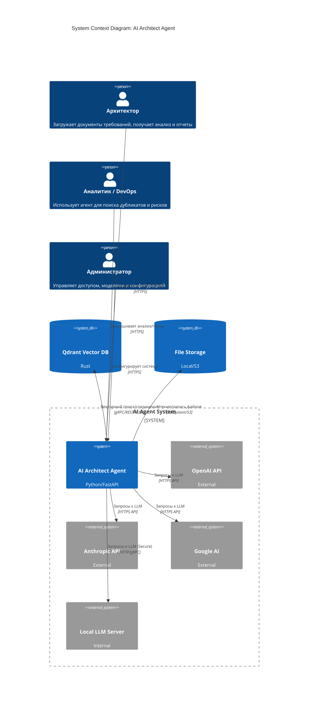
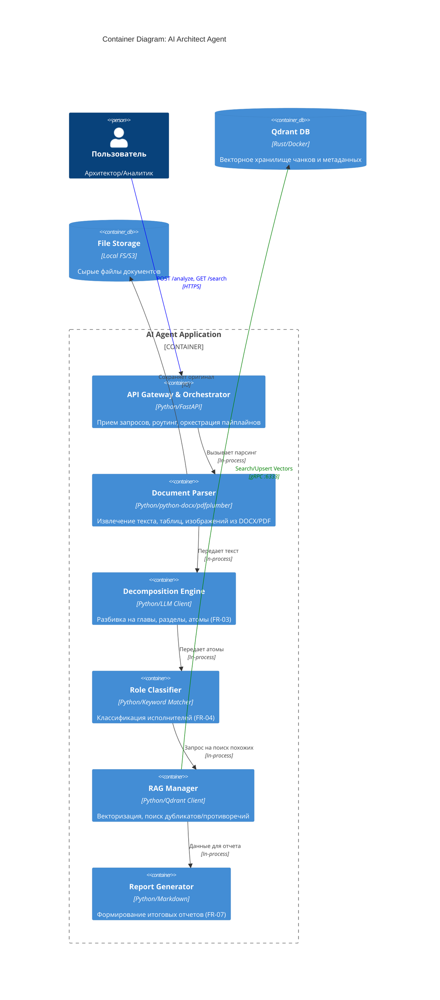
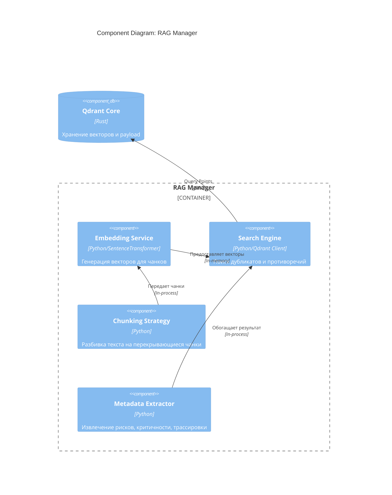

# Модель C4 (C4 Model) для AI Architect Agent

Этот документ содержит детальное описание архитектуры системы в нотации C4 (Context, Container, Component, Code) для проекта **AI Architect Agent**.

## Обзор уровней C4

Модель C4 предоставляет иерархическое представление архитектуры программного обеспечения на четырех уровнях абстракции:

1.  **Level 1: System Context** - Как система вписывается в мир пользователей и других систем.
2.  **Level 2: Containers** - Высокоуровневые технологические блоки приложения.
3.  **Level 3: Components** - Детали реализации внутри контейнеров.
4.  **Level 4: Code** - Диаграммы классов и кода (не включены в этот документ, см. исходный код).

---

## Level 1: System Context Diagram

Диаграмма показывает систему в центре и её взаимодействие с пользователями и внешними системами.

### Акторы (People)

| Актор | Описание |
|-------|----------|
| **Архитектор** | Основная роль. Загружает документы требований, инициирует анализ, получает отчеты о декомпозиции, рисках и дубликатах. |
| **Аналитик / DevOps / РП** | Смежные роли. Используют агент для поиска существующих решений, анализа рисков и проверки противоречий. |
| **Администратор** | Управляет конфигурацией системы, добавляет пользователей, настраивает подключение к AI моделям. |

### Внешние системы (External Systems)

| Система | Тип | Назначение |
|---------|-----|------------|
| **OpenAI API** | External | Предоставление модели GPT-4 Turbo для сложных задач декомпозиции и рассуждений. |
| **Anthropic API** | External | Предоставление модели Claude 3.5 Sonnet как альтернативы для анализа текста. |
| **Google AI** | External | Предоставление модели Gemini Pro для мультимодального анализа (текст + изображения). |
| **Local LLM Server** | Internal | Внутренний сервер с моделями Llama 3 / Mistral для работы в закрытом контуре безопасности. |
| **Qdrant Vector DB** | Database | Хранение векторных представлений чанков документов и метаданных для RAG поиска. |
| **File Storage** | Database | Хранилище исходных файлов документов (DOCX, PDF, изображения). |

### Диаграмма (Mermaid)



---

## Level 2: Container Diagram

Детализирует систему на основные технологические блоки (контейнеры). В данном контексте "контейнер" означает единицу развертывания (приложение, база данных), а не обязательно Docker-контейнер.

### Контейнеры системы

| Контейнер | Технология | Ответственность |
|-----------|------------|-----------------|
| **API Gateway & Orchestrator** | Python (FastAPI) | Прием HTTP запросов, аутентификация, проверка ролей, оркестрация пайплайнов обработки. |
| **Document Parser** | Python (python-docx, pdfplumber) | Извлечение структурированного текста, таблиц, заголовков и изображений из бинарных файлов. |
| **Decomposition Engine** | Python + LLM Client | Логика разбиения документа на иерархию (Главы -> Разделы -> Абзацы) и создание атомарных требований. |
| **Role Classifier** | Python (Rule-based + LLM) | Классификация атомарных требований по типам исполнителей (Архитектор, Аналитик, DevOps и т.д.). |
| **RAG Manager** | Python (Qdrant Client, SentenceTransformers) | Генерация эмбеддингов, поиск похожих требований, выявление дубликатов и противоречий в векторной БД. |
| **Report Generator** | Python (Jinja2/Markdown) | Сборка финального отчета в формате Markdown или JSON согласно шаблону FR-07. |

### Диаграмма (Mermaid)



---

## Level 3: Component Diagram (RAG Manager)

Фокусируется на внутреннем устройстве наиболее сложного контейнера — **RAG Manager**, отвечающего за работу с векторной базой знаний.

### Компоненты RAG Manager

| Компонент | Технология | Ответственность |
|-----------|------------|-----------------|
| **Embedding Service** | SentenceTransformers | Генерация векторных представлений (эмбеддингов) для текстовых чанков. Использует модель `all-MiniLM-L6-v2`. |
| **Search Engine** | Qdrant Client | Выполнение векторного поиска (Similarity Search), фильтрация по метаданным (роли, риски, критичность). |
| **Chunking Strategy** | Custom Python | Реализация стратегии разбивки текста на перекрывающиеся чанки (overlap) для улучшения качества поиска. |
| **Metadata Extractor** | Python | Извлечение и валидация метаданных из результатов поиска (трассировка к источнику, оценка схожести). |

### Диаграмма (Mermaid)



---

## Динамическая модель (Sequence Diagram)

Последовательность действий при обработке нового документа.

```mermaid
sequenceDiagram
    participant User as Архитектор
    participant API as API Gateway
    participant Parser as Document Parser
    participant Decomp as Decomposition Engine
    participant RAG as RAG Manager
    participant Qdrant as Qdrant DB
    participant LLM as AI Model (GPT-4/Claude)

    User->>API: POST /analyze (document.docx)
    activate API
    API->>API: Проверка роли (Architect?)
    
    API->>Parser: Parse document
    activate Parser
    Parser->>Parser: Извлечь текст, таблицы, заголовки
    Parser-->>API: Структурированный текст
    deactivate Parser

    API->>Decomp: Decompose to atoms
    activate Decomp
    Decomp->>LLM: Generate atoms (Fact, Risk, Rec)
    activate LLM
    LLM-->>Decomp: Список атомарных требований
    deactivate LLM
    Decomp-->>API: Иерархия атомов
    deactivate Decomp

    API->>RAG: Find duplicates/contradictions
    activate RAG
    RAG->>RAG: Generate embeddings
    RAG->>Qdrant: Search similar vectors (>50%)
    activate Qdrant
    Qdrant-->>RAG: Список похожих требований
    deactivate Qdrant
    RAG-->>API: Результаты поиска (дубликаты/риски)
    deactivate RAG

    API->>LLM: Enrich analysis with RAG context
    activate LLM
    LLM-->>API: Финальный анализ и рекомендации
    deactivate LLM

    API->>Qdrant: Save new atoms to DB
    activate Qdrant
    Qdrant-->>API: Confirm saved
    deactivate QDRANT

    API-->>User: Markdown Report
    deactivate API
```

---

## Глоссарий терминов

| Термин | Определение |
|--------|-------------|
| **Атомарное требование** | Минимальная смысловая единица документа, содержащая Факт, Риск и Рекомендацию. Не может быть разделена дальше без потери смысла. |
| **Чанк (Chunk)** | Фрагмент текста, используемый для генерации векторного представления. Может перекрываться с соседними чанками. |
| **Эмбеддинг (Embedding)** | Векторное представление текста в многомерном пространстве, позволяющее вычислять семантическую схожесть. |
| **RAG (Retrieval-Augmented Generation)** | Архитектурный паттерн, сочетающий поиск информации в базе знаний с генерацией ответа языковой моделью. |
| **Трассировка** | Возможность проследить связь между атомарным требованием и исходным фрагментом документа (номер страницы, абзаца). |
| **Qdrant** | Векторная база данных с открытым исходным кодом, оптимизированная для хранения и поиска векторов высокой размерности. |

---

## Ссылки

- [Официальная спецификация C4 Model](https://c4model.com/)
- [Документация Qdrant](https://qdrant.tech/documentation/)
- [Исходный код проекта](https://github.com/aov1983/AIAgent_aov_Doc)
